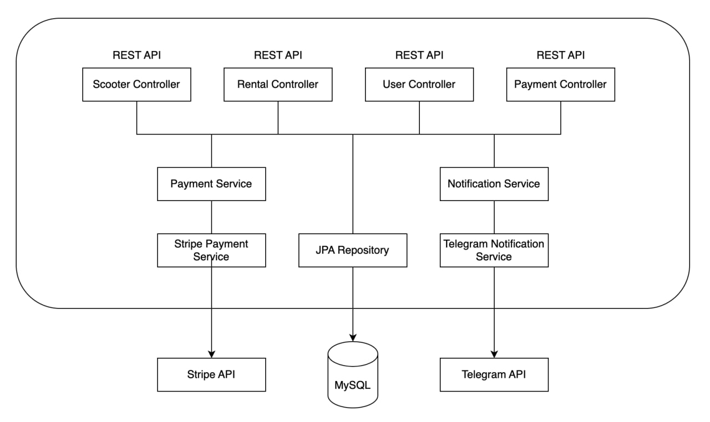

# <h1 align = "center">🛵 SCOOTER RENTAL 🛴</h1>

### 📄 Project Description
This web service is an innovative scooter rental service that allows users to easily and conveniently rent scooters for quick and cheap city transportation. The service is aimed at improving urban mobility, reducing traffic jams and helping to preserve the environment.

### 🛠 Functionality

- Web-based
- Manage scooter sharing inventory
- Manage scooter rentals
- Manage customers
- Display notifications
- Handle payments
- Telegram notifications

### 💡 Architecture
Project consists main layer:
* repository;
* service;
* controller;

### ⚙️ Project Structure

- `config` - this package contains configuration files.
- `controller` - this package contains the controllers.
- `dto` - this package contains data transfer objects that are used to encapsulate and transfer data between the
  different layers of the application. These objects help to unify requests and responses in the controllers.
- `exception` - this package contains custom exceptions.
- `lib` - this package contains custom annotations for validation email and password.
- `model` - this package contains the model for the database. This model is used to represent data entities in the
  database and is used by the DAO to map database records to Java objects.
- `repository` - this package contains the data access layer (also known as the repository layer) that is responsible
  for accessing and manipulating data in the database.
- `security` - this package contains security settings.
- `service` - this package contains the services that call the repositories. These services are responsible for
  performing business logic and coordinating the interactions between the controllers and the DAO.
- `telegrambot` - this package contains Telegram bot settings.

### 🚀 Endpoints

- Authentication Controller
    - POST: `/register` - register a new user
    - POST: `/login` - login to the system, get JWT token

- Users Controller
    - PUT: `/users/{id}/role` - update user role
    - GET: `/users/me` - get my profile info
    - PUT: `/users/me` - update profile info

- Scooters Controller
    - POST: `/scooters` - add a new scooter
    - GET: `/scooters` - get a list of scooters
    - GET: `/scooters/{id}` - get scooter's detailed information
    - PATCH: `/scooters/{id}`- update scooter (also manage inventory)
    - DELETE: `/scooters/{id}` - delete scooter

- Rentals Controller
    - POST: `/rentals` - add a new rental
    - GET: `/rentals` - get rentals by userId and and whether the rental is still active or not
    - GET: `/rentals/{id}` - get specific rental
    - POST: `/rentals/{id}/return` - set actual return date 

- Payments Controller
    - GET:    `/payments` - get payments
    - POST:    `/payments` - create payment session
    - GET:    `/payments/success` - check successful Stripe payments (Endpoint for stripe redirection)
    - GET:    `/payments/cancel` - return payment paused message
    (Endpoint for stripe redirection)

### ⚡️ Telegram notifications
In this project, users and managers are notified using a Telegram bot.
Notifications are sent when leases are created, leases are overdue, and payments are successful.

### 🏗️ Project scheme

### 🤖  Technologies used
* Java `17`
* Maven `3.1.1`
* Mapstruct `1.4.2`
* Spring Framework:
    * Boot `2.7.9`
    * Data Jpa `3.0.6`
    * Web Mvc `6.0.8`
* Liquibase `4.23.0`
* Lombok `1.18.22`
* Swagger UI `1.6.12`
* SpringDoc `2.1.0`
* Checkstyle Plugin `3.1.1`
* Stripe `20.108.0`
* Mockito `3.11.2`

### 💻 Getting started
To get started with the Scooter Rental project, follow these steps:
- Clone the repository: git clone `https://github.com/roman-java-dev/scooter_rental`
- You need to get a token to create a Telegram-bot `https://t.me/BotFather`
- Register on [Stripe](https://stripe.com/)
- Configure field values to your specific properties in [application.properties](src/main/resources/application.properties) file in the project.
- Run the application
- Test the application with swagger using address `http://localhost:8080/swagger-ui/index.html#/`